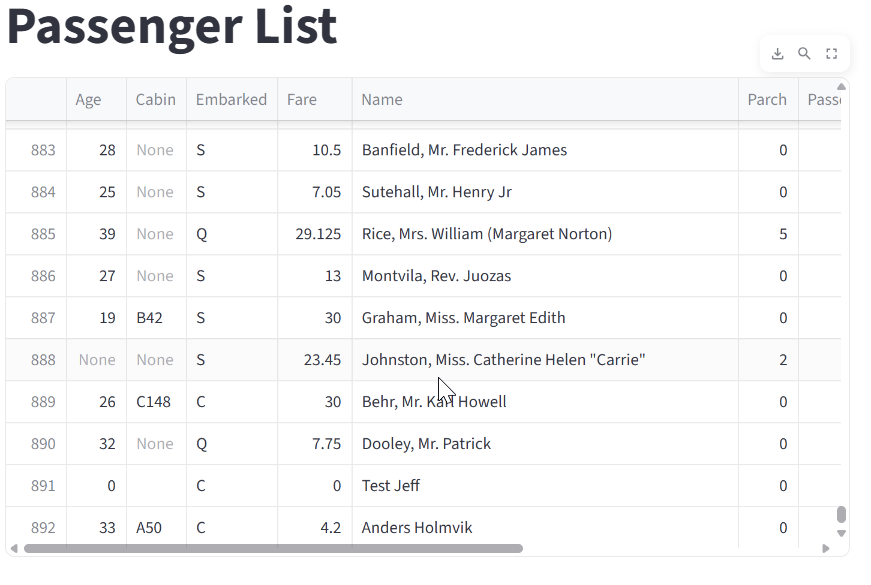

# IEXcapstone

This project is a complete end-to-end data application that includes:

- Streamlit for the user interface and interactive data visualization
- Flask API for backend communication and data updates
- SQLite3 as a lightweight local database
- Scikit-learn for machine learning prediction
- Docker Compose for easy local setup of all services

---

## What I Learned

This capstone project helped reinforce a range of important technical skills:

- Software design and architecture (separating backend, frontend, ML)
- Python best practices for modular development
- Machine learning pipeline: data prep, model training, pickling
- REST API design and CRUD operations with Flask
- Using Streamlit to build interactive web apps and forms
- Working with Docker and Docker Compose for full-stack development

---

## How to Run the Project

### Requirements

- Docker Desktop installed and running
- Git (to clone the repository)

### Step 1: Clone the Repository

```bash
git clone https://github.com/jefrya123/IEXcapstone/tree/main
cd titanic-capstone
```

### Step 2: Build and Run the App with Docker Compose

```bash
docker compose up --build
```

This will start:
- Flask API at `http://localhost:5000`
- Streamlit app at `http://localhost:8501`

Note: The SQLite database (`titanic.db`) is recreated each time.

---

## Project Features

### Home Page

Overview of the app and navigation.


### Visual Data

Bar charts showing survival rates based on passenger class, sex, and embarkation port.


### Survival Prediction

Enter a passenger’s features (class, sex, age, etc.) to predict survival using a trained RandomForestClassifier.


### Add Passenger

Submit a form to add a new passenger.

- Passenger ID auto-generates on add




### Update Passenger

Submit a form to Update a existing passenger.


---

## Machine Learning

### Model Training

- File: `models/train_titanic_model.py`
- Trains a RandomForestClassifier using the Titanic dataset
- Saves the trained model as `titanic_model.pkl`

### Prediction Logic

- File: `streamlit_app/pages/2_survival_prediction.py`
- Loads the pickled model
- Accepts input from the user form
- Predicts survival as either 0 (did not survive) or 1 (survived)

---

## Folder Structure

```bash
.
├── data/
├── models/
│   ├── train_titanic_model.py
│   └── titanic_model.pkl
├── flask_api/
│   ├── api.py
│   └── data_import.py
├── streamlit_app/
│   ├── Home.py
│   └── pages/
│       ├── 1_visual_data.py
│       ├── 2_survival_prediction.py
│       ├── 3_passenger_info.py
│       └── 4_add_update_passenger.py
├── titanic.db
├── requirements.txt
├── Dockerfile
├── docker-compose.yml
└── README.md
```

---

## Notes

- The local SQLite database resets every time you restart the Docker containers unless volumes are configured.
- The Passenger ID is automatically generated on add, preventing duplicates.
- All form data is validated before being sent to the backend.

---

## Future Improvements

- Add user authentication (log in/log out)
- Add search or filtering in passenger lookup
- Export predictions or full passenger list to CSV
- Deploy to AWS, Azure, or Render for cloud hosting

---

## Contact

For questions or feedback, feel free to reach out:

**Jeffery Ryan**  
GitHub: [@jefrya123](https://github.com/jefrya123)  
Email: jeffery.ryan@gdit.com